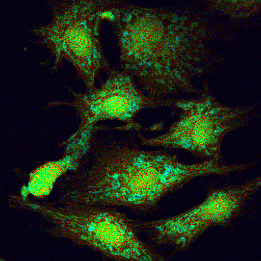
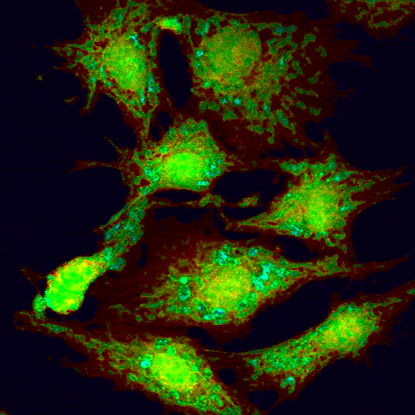
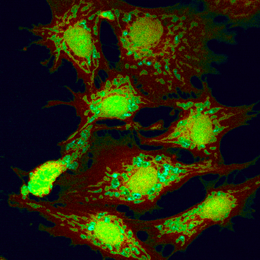

# Lifetime_denoising_JPP

# For lifetime denoising code:

Input (noisy) composite lifetime Image: In the HSV format, where hue and value are mapped to lifetime and intensity respectively.

Denoised composte lifetime Image: From the trained Noise2Noise ML model (trained on the FMD dataset): In the HSV format, where hue and value are mapped to lifetime and intensity respectively.

Target composite lifetime Image: In the HSV format, where hue and value are mapped to lifetime and intensity respectively.

# ML model:

Input image dimensions are: 512x512 slices into 256x256 image:
G and S images are pass through the trained Noise2Noise model and denoised images are 256x256 slices joined together to form complete 512x512 denoised $G$ and $S$ images. Here to represent the lifetime images, the HSV format where hue and value are mapped to lifetime and intensity respectively is used (always we use here the intensity image is the acquired raw noisy intensity image). 

# Dataset:

#Images: The lifetime images used in the inference stage can be downloaded from here https://curate.nd.edu/show/mw22v40954f

#Citation for dataset: Please cite the FMLD dataset using the following format: 
Mannam, Varun. “Fluorescence Microscopy Lifetime Denoising (FMLD) Dataset.” Notre Dame, January 1, 2020. https://doi.org/10.7274/r0-18da-9m58.

## License & Copyright
© 2019 Varun Mannam, University of Notre Dame

Licensed under the [Apache License 2.0](https://github.com/varunmannam/Lifetime_denoising_JPP/blob/master/LICENSE)
